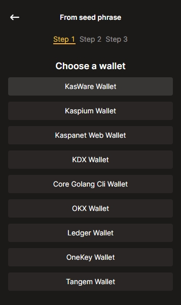
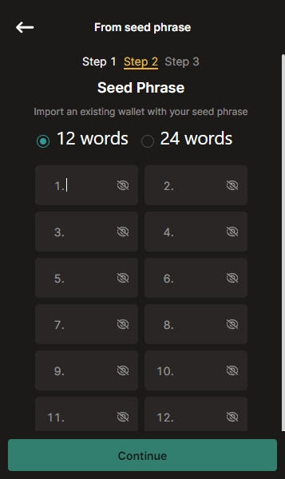
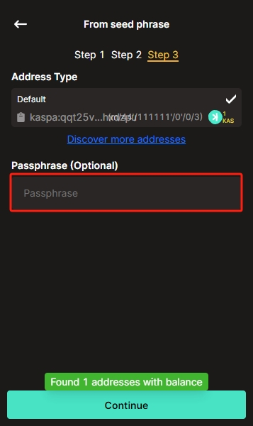
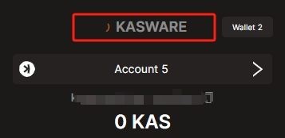
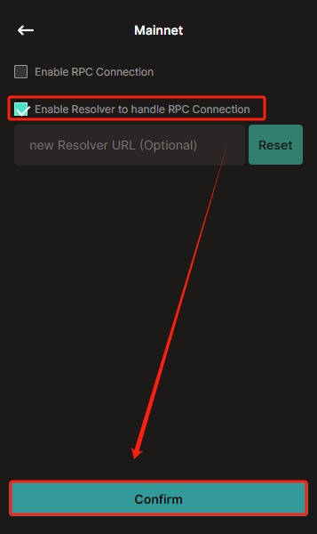

If you are having trouble with your addresses and balances, please check the following:

# address

Go to [https://explorer.kaspa.org/](https://explorer.kaspa.org/) or [https://kas.fyi/](https://kas.fyi/) to check your balance.

# import wallets

If you get a different address after importing a wallet, there are 3 key factors to confirm:
- source wallet where the seedphrase was generated

    
- seedphrase

    
- passphrase if you used one

    

# wallet version

[update your wallet](../knowledge-base/update-your-wallet.md) to the latest version.

# network

If your wallet keeps connecting, try the following:

- By default, the public wrpc node is used. Confirm the resolver option as follows:
    
- If the public wrpc nodes is not working, you can [set your own wrpc](../knowledge-base/set-your-own-rpc.md)