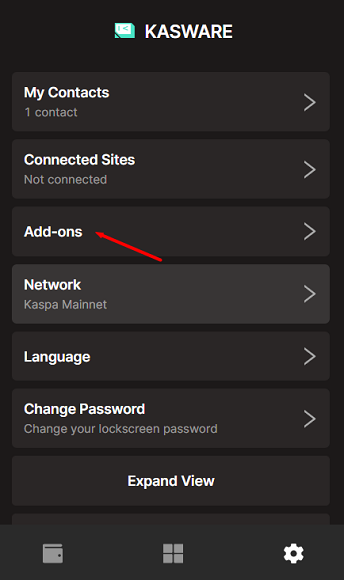
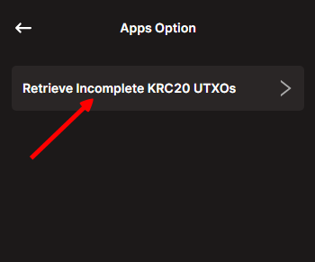
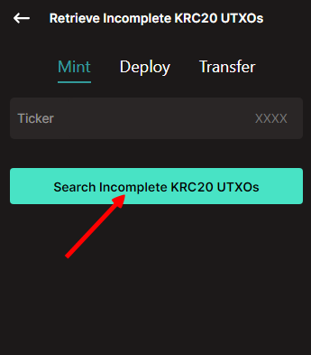
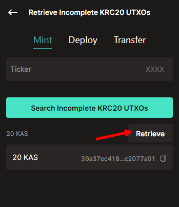
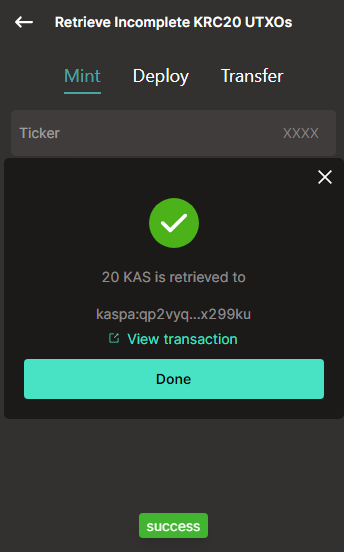

# Retrieve Incomplete KRC20 Fund

This is little tool is to help users retreive funds stuck in incomplete KRC20 transactions.

## Background

I need to explain the second feature called retrieve incomplete kasplex funds below:
Most people know the KRC20 involves two transactions. If the first is successful while the second failed, **users' KAS is stuck in the another addresses called commit address**.

So we have built a little tool can help users retrieve these funds.

And for the retrieve, users have to remember input parameters like ticker name, amount, etc. when mint/deploy/transfer.

the parameter of mint is simple, it’s mainly a ticker name. We have build a list of all ticker names. and the tool will loop all ticker names to find the one users have lost.

However, parameters of transfer/deploy are a little complicated. users have to remember amount, tickers, pre-allocaiton, etc. It's impossible to loop all possibility. So users have to input every parameter by themselves.

## Tutorial

1. go to the setting tab. and click "Apps" option.

1. Click “Retrieve Incomplete KRC20 UTXOs” tool.

1. Click “Search Incomplete KRC20 UTXOs” button. It will automaticlly search all availabe KRC20 tickers to find if your address contains any incomplete UTXOs.
    
    you can also input ticker name, or deployment/transfer details you once done before. It will help find incomplete UTXOs.
    

1. All availabe UTXOs will be displayed below. Click “Retrieve”

1. KAS is retrieved to your address.

Hope it could help you.

# About KasWare

Website: [https://www.kasware.xyz/](https://www.kasware.xyz/)

X/Twitter: [https://twitter.com/kasware_wallet](https://twitter.com/kasware_wallet)

Discord: [https://discord.gg/8FSkXrjhGT](https://discord.gg/8FSkXrjhGT)

Telegram: [https://t.me/kasware_wallet](https://t.me/kasware_wallet)

Webstore: [https://chromewebstore.google.com/detail/kasware-wallet/hklhheigdmpoolooomdihmhlpjjdbklf](https://chromewebstore.google.com/detail/kasware-wallet/hklhheigdmpoolooomdihmhlpjjdbklf)

FAQ: [https://awake-poultry-358.notion.site/KasWare-Wallet-FAQ-237f8401b2bc4d74881fbbb3eb26daf6](https://www.notion.so/KasWare-Wallet-FAQ-237f8401b2bc4d74881fbbb3eb26daf6?pvs=21)