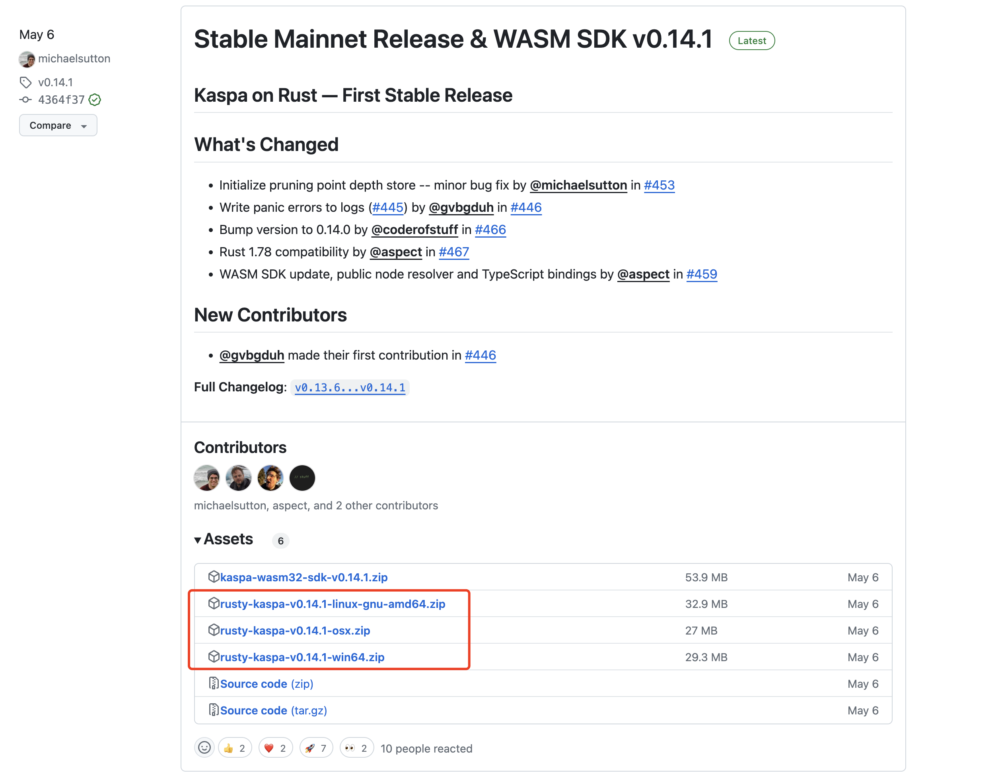

# Hardware requirements

* 4CPU
* 8GB RAM
* 30GB free disk space

# Download the installation package
Go to [https://github.com/kaspanet/rusty-kaspa/releases](https://github.com/kaspanet/rusty-kaspa/releases)

Download the corresponding binary installation file according to your operating system.



# Run rusty-kaspa node

Unzip the binary file, and enter the unzipped directory. Execute the following command on the console to start the node and keep the console window open to wait for the data synchronization to complete.

## windows

```powershell
.\kaspad.exe --utxoindex --rpclisten-borsh=default --disable-upnp
```
## macos

```bash
./kaspad --utxoindex --rpclisten-borsh=default --disable-upnp
```
The first time you run it, you need to make some security-related settings as shown below.


Re-execute the following command on the console.


## linux

```bash
./kaspad --utxoindex --rpclisten-borsh=default --disable-upnp
```

# Data synchronization

The Data synchronization takes about 30 minutes, and when you see following messages, the synchronization is complete.

Note: Do not close the console window.


# Config kasware rpc

Follow the steps shown to configure rpc.


