# Recommended hardware 

* 4core CPU
* 8GB RAM
* 30GB free disk space

# GUI Mode
## Download the installation package
Go to [https://github.com/aspectron/kaspa-ng/releases](https://github.com/aspectron/kaspa-ng/releases)

Download the latest corresponding binary installation file according to your operating system.

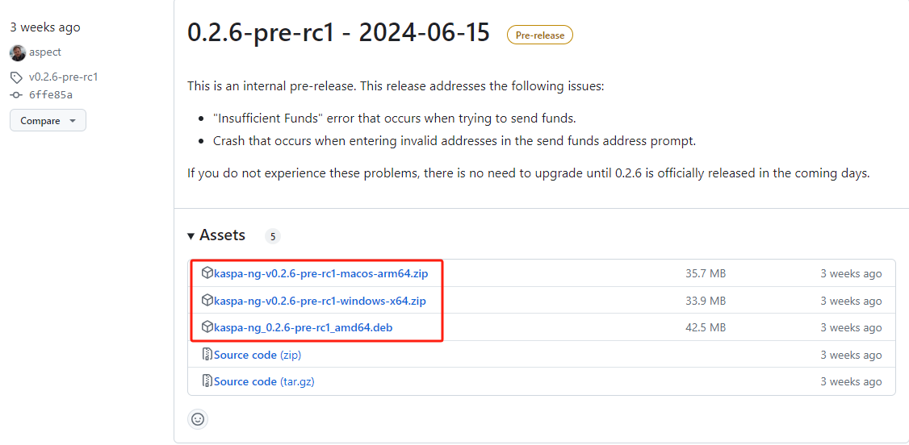

## Run

### Windows

Unzip the binary file, and enter the unzipped directory. Double-click the kaspa-ng.exe file to start the node.

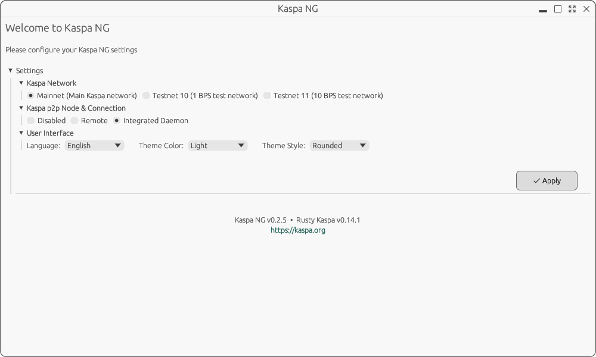
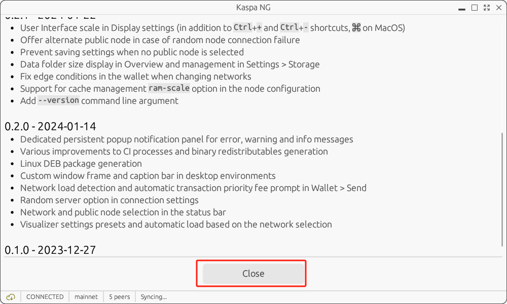
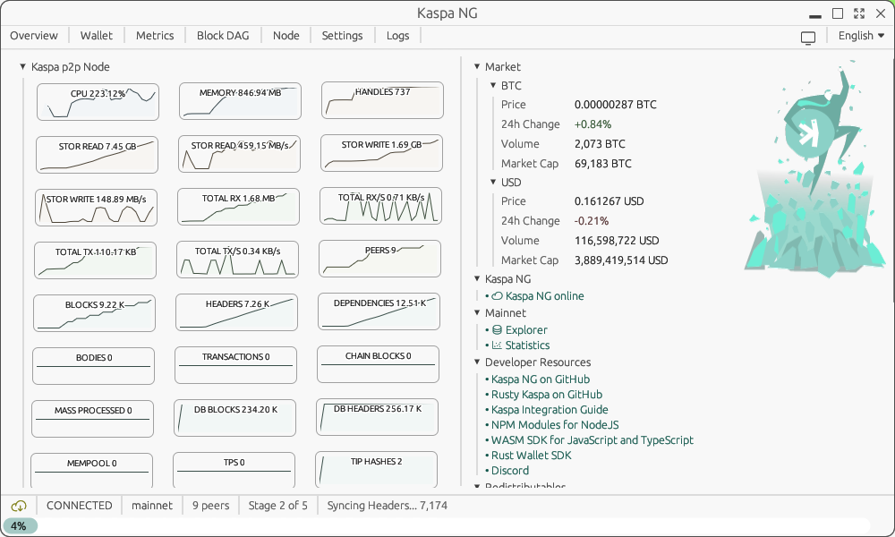

Please wait for data synchronization to finish. The process is complete when the following message appears.

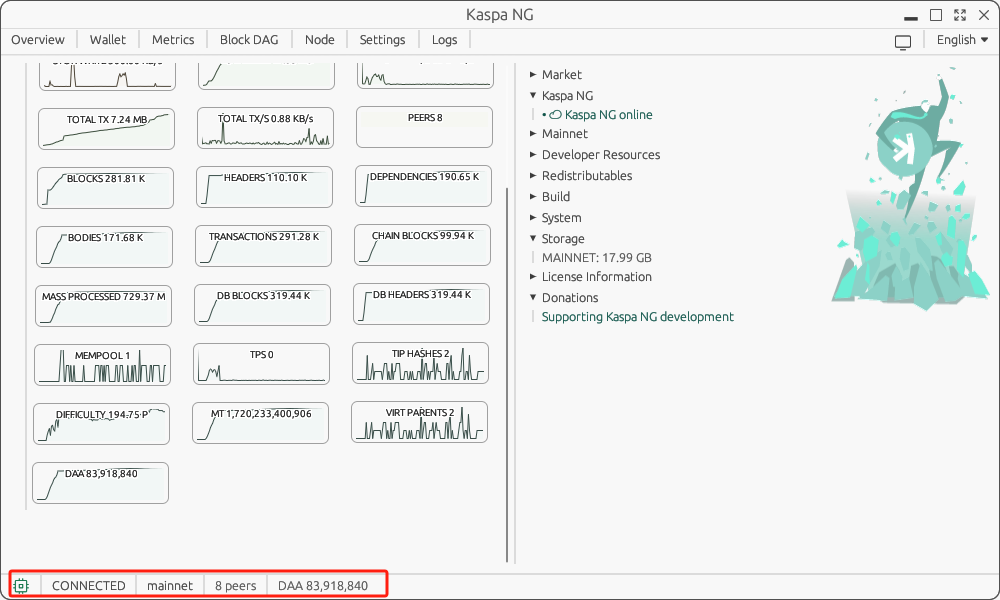

### Macos

### Linux distributions that support the deb application format

```bash
sudo dpkg -i ./kaspa-ng_0.2.6-pre-rc1_amd64.deb

kaspa-ng
```
Graphic operation part is the same as windows.

# Command-line Mode

## Download the installation package
Go to [https://github.com/kaspanet/rusty-kaspa/releases](https://github.com/kaspanet/rusty-kaspa/releases)

Download the corresponding binary installation file according to your operating system.

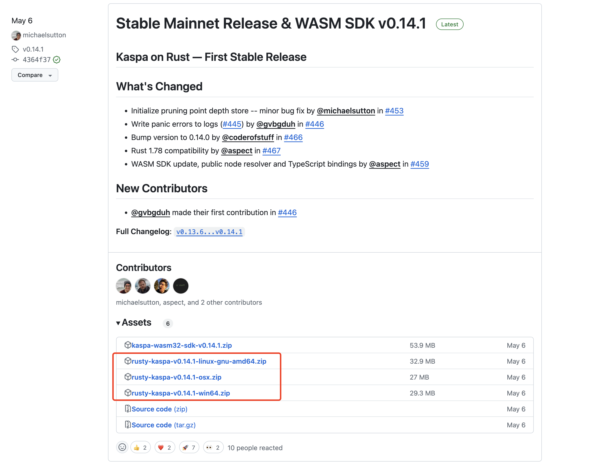

## Run rusty-kaspa node

Unzip the binary file, and enter the unzipped directory. Execute the following command on the console to start the node and keep the console window open to wait for the data synchronization to complete.

Note: For more command options, run kaspad --help. In particular, when --rpclisten-borsh=public, the rpc can be used by other devices. 

### windows

```powershell
.\kaspad.exe --utxoindex --rpclisten-borsh=default --disable-upnp
```
### macos

```bash
./kaspad --utxoindex --rpclisten-borsh=default --disable-upnp
```
The first time you run it, you need to make some security-related settings as shown below.

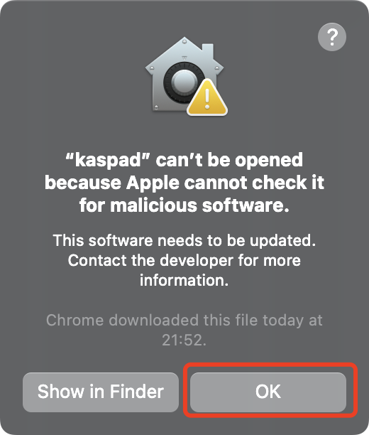
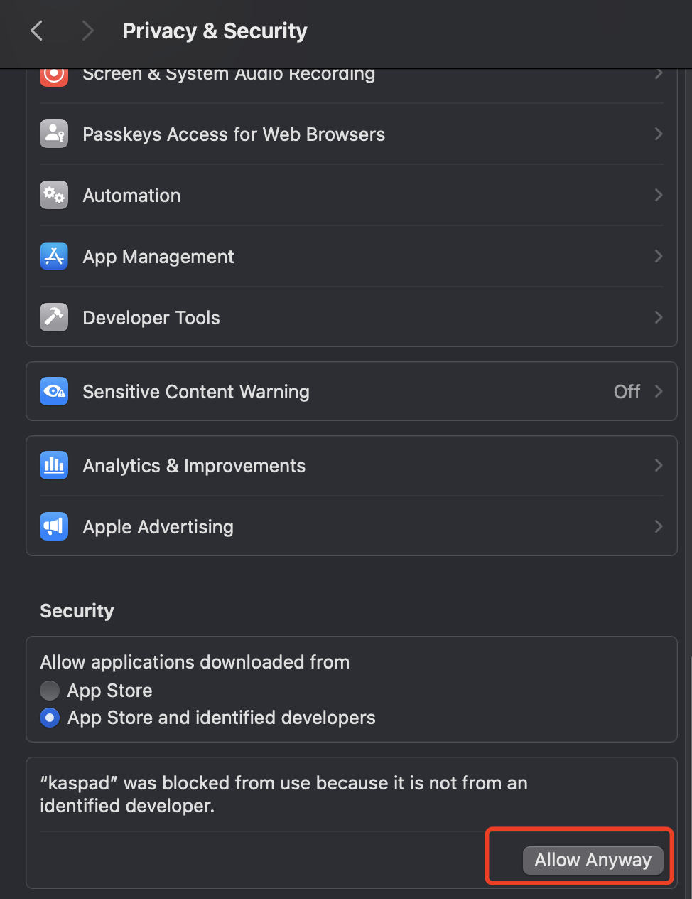

Re-execute the following command on the console.

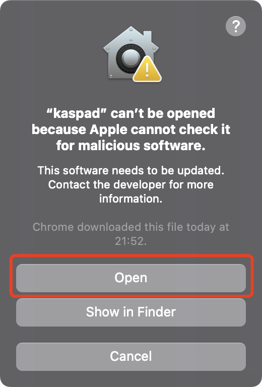

### linux

```bash
./kaspad --utxoindex --rpclisten-borsh=default --disable-upnp
```

## Data synchronization

Data synchronization takes approximately half an hour to one and a half hours, depending on your network and computer configuration. And when you see following messages, the synchronization is complete.

Note: Do not close the console window.

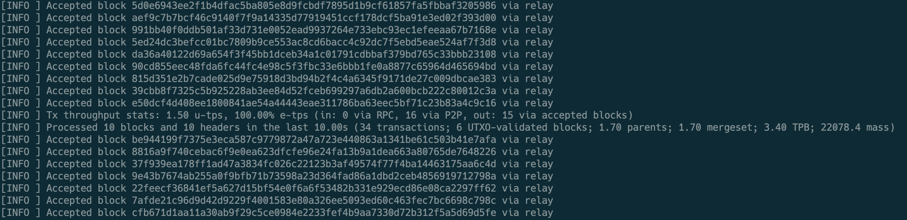

# Config kasware rpc

Follow the steps shown to configure rpc to ws://127.0.0.1:17110.

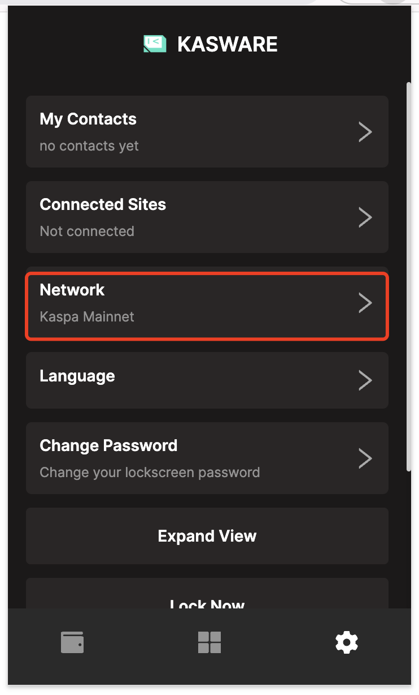
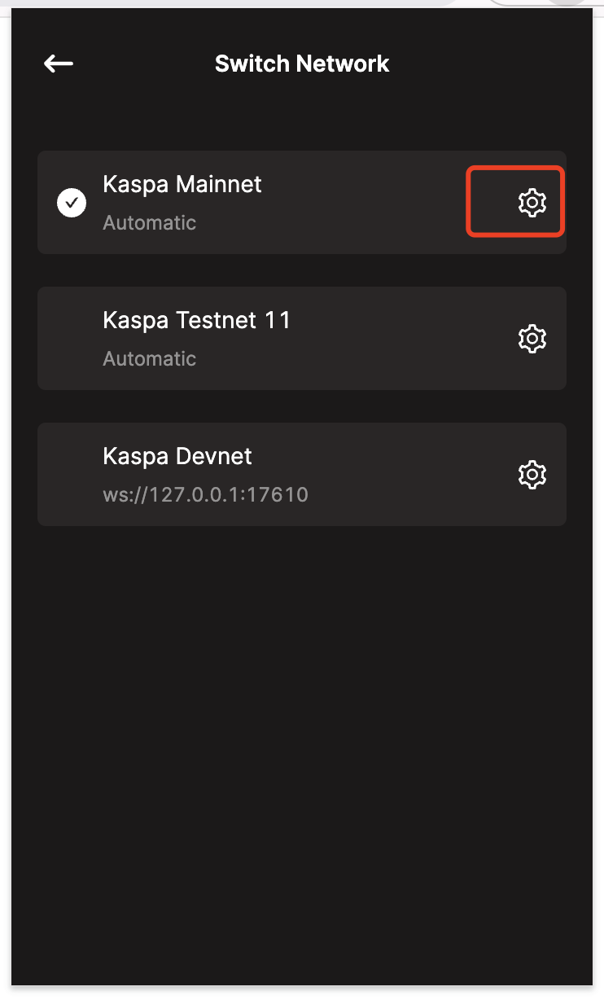
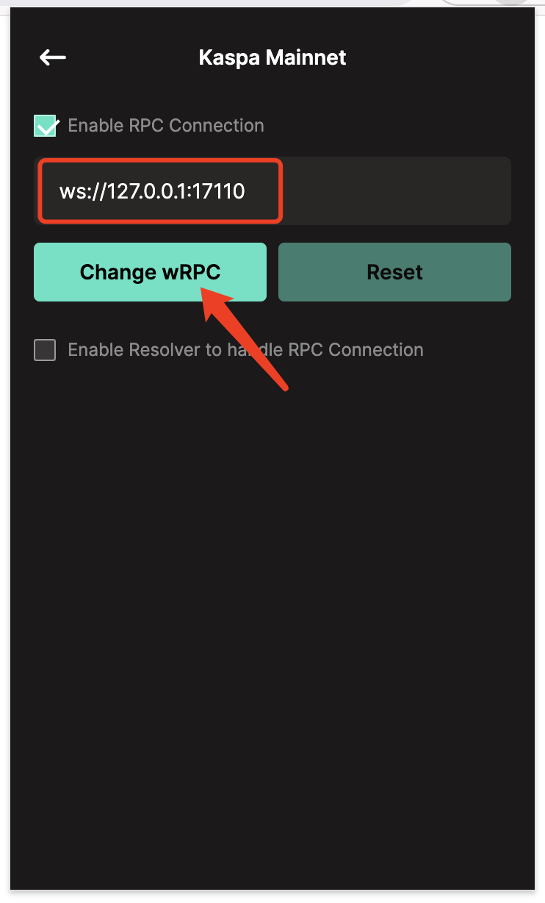

