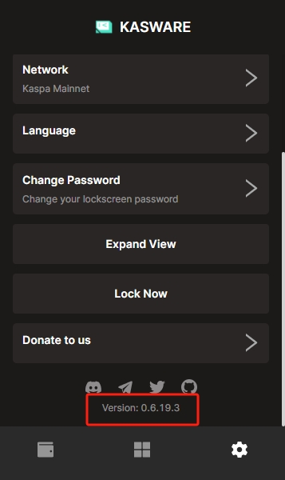
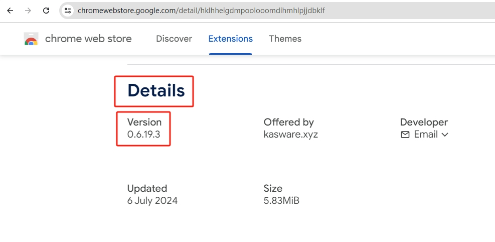
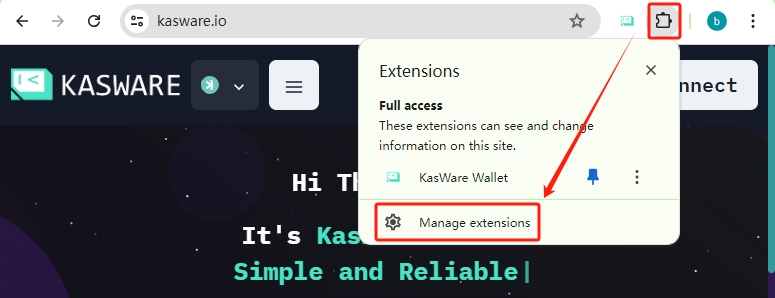
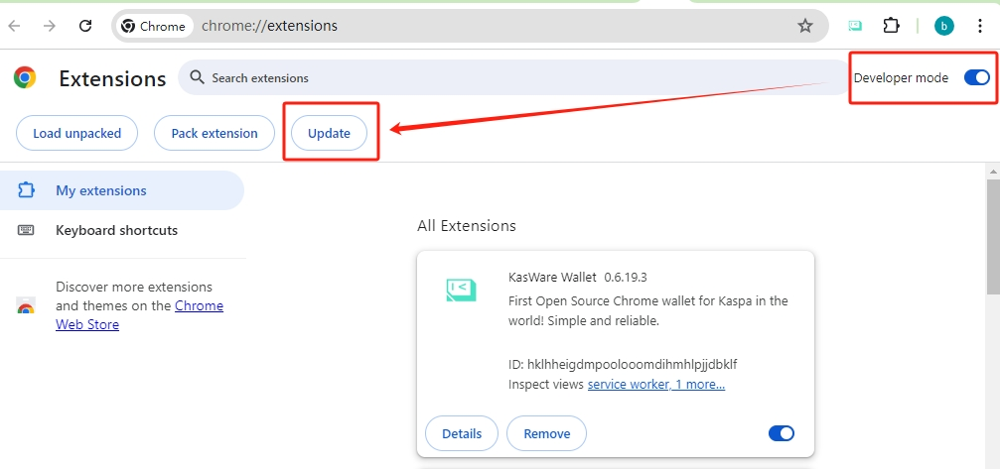

# Update Your Wallet

## chrome extension

Usually, the extension will be auto-updated. If your extension didn't update to the latest version, then you may follow the steps below to update it.

1. Check the current version of your wallet.

2. Visit [KasWare Wallet extension on Chrome Webstore](https://chromewebstore.google.com/detail/hklhheigdmpoolooomdihmhlpjjdbklf) to confirm the latest version. If you are using the latest version, you can skip the next step.

3. Click on the extension icon on the top right of your screen, then click "Manage extensions" menu.

4. Switch on to Developer mode, then click the "Update" button.

5. Then your wallet will be updated to the latest version.

## android app

Go to the [kasware-app github repo](https://github.com/kasware-wallet/kasware-app/releases). Download the latest .apk file and install it.
